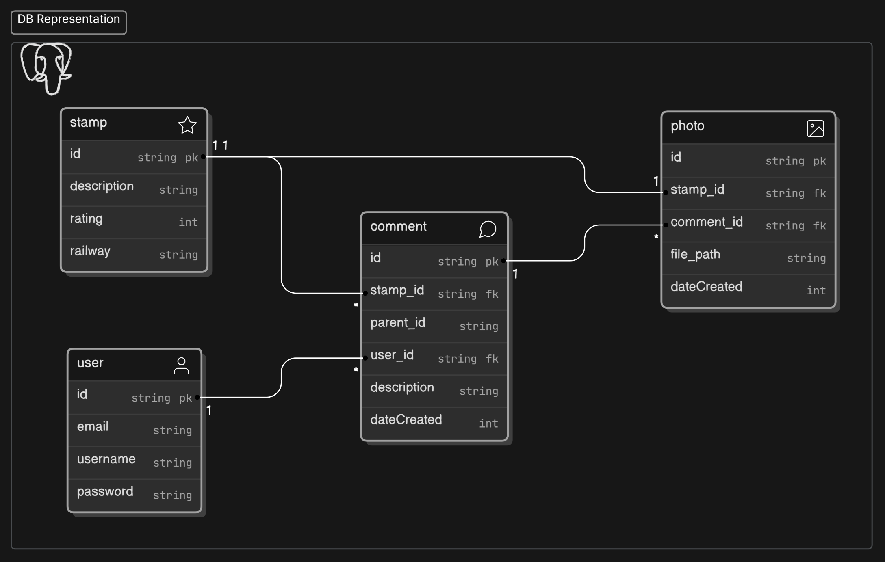
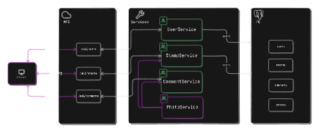
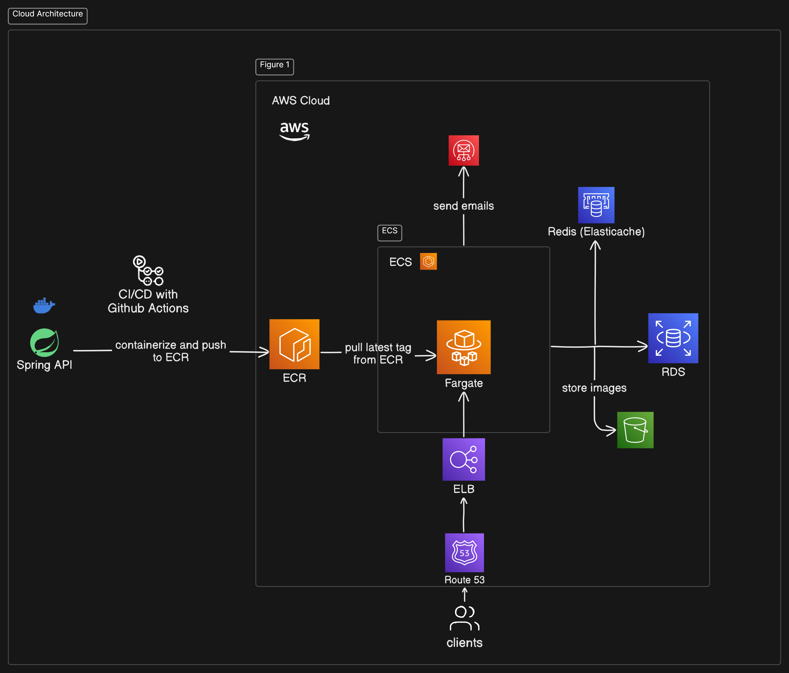

# Japan Railway Stamp App

This app is a RESTful API made with Spring Boot intended to be consumed by a web front-end designed for people who are interested in Japan's railway stamp collection system. This app looks to solve the problem of hard-to-find stamps and stamps that
no-longer exist by creating a hub where collectors can gather to share latest information about a specific stamp.

The stamp page provides information on the stamp's location: the railway system and the station number along with its visual and size.

Over the summer, I've took my own time learning Spring and Spring Boot and wanted to create this as my first project with Spring to gain experience. I read books and blogs on system design to create the architecture below.
The diagrams are constantly changing as I make improvements to the app.

The goal of this project is to gain hands-on experience with building a scalable web app by over-engineering it as much as possible to expose myself to as many tools that are frequently used
in enterprise apps and deploying it to the cloud. I also plan to deploy it to a small user base of tourists who are interested in collecting things like myself; to solve a need and create a community.

## Design Architecture

### Entity-Relationship Diagram

### Services Diagram

### Cloud Architecture

