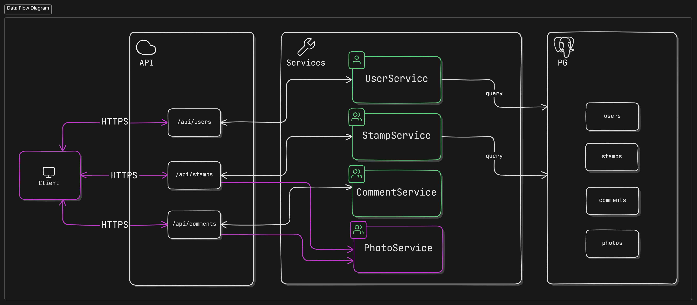

## Japan Railway Stamp App

This app is a server application made with Spring Boot intended to be consumed by a web front-end designed for people who are interested in Japan's railway stamp collection system. This app looks to solve the problem of hard-to-find stamps and stamps that
no-longer exist by creating a hub where collectors can gather to share latest information about a specific stamp.

The stamp page provides information on the stamp's location: the railway system and the station number along with its visual and size.

The goal of this project is to gain hands-on experience with building a scalable web app by over-engineering it as much as possible to expose myself to as many tools that are frequently used
in enterprise apps and deploying it to the cloud.

## Design Architecture

